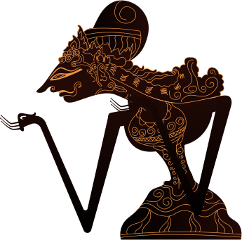

# Personal Portfolio Website

A modern, interactive personal portfolio website built with React, TypeScript, and Vite. This project showcases my skills, projects, and experience with a unique touch of Indonesian traditional culture (Wayang theme) integrated into a modern design.


_(Note: You can update this image path with a real screenshot of your website later)_

## 🌟 Key Features

- **Interactive Hero Section**: Features a custom parallax effect that responds to both mouse movement and scrolling, creating a deep, immersive 3D feel using Wayang and Gunungan elements.
- **Modern & Responsive Design**: Built with Tailwind CSS to ensure the site looks great on all devices, from mobile phones to large desktop screens.
- **Smooth Animations**: Utilizes Framer Motion for fluid transitions, scroll animations, and interactive elements.
- **Carousel Gallery**: Implements SplideJS for showcasing projects in a sleek, touch-friendly carousel.
- **Component-Based Architecture**: Modular and reusable code structure following React best practices.

## 🛠️ Tech Stack

- **Framework**: [React](https://react.dev/) + [TypeScript](https://www.typescriptlang.org/)
- **Build Tool**: [Vite](https://vitejs.dev/)
- **Styling**: [Tailwind CSS](https://tailwindcss.com/)
- **Animations**: [Framer Motion](https://www.framer.com/motion/)
- **Carousel**: [SplideJS](https://splidejs.com/)

## 🚀 Getting Started

To get a local copy up and running, follow these simple steps.

### Prerequisites

- Node.js (v14 or higher)
- npm (v6 or higher)

### Installation

1.  **Clone the repository**

    ```bash
    git clone https://github.com/hafidzzakky/portofolio.git
    cd portofolio
    ```

2.  **Install dependencies**

    ```bash
    npm install
    ```

3.  **Run the development server**
    ```bash
    npm run dev
    ```
    Open [http://localhost:5173](http://localhost:5173) with your browser to see the result.

## 📂 Project Structure

```
src/
├── assets/          # Images, SVGs, and other static assets
├── components/      # Reusable UI components (HeroParallax, etc.)
├── sections/        # Main page sections (Hero, About, Projects, etc.)
├── App.tsx          # Main application component
├── main.tsx         # Entry point
└── index.css        # Global styles and Tailwind imports
```

## 📝 License

Distributed under the MIT License. See `LICENSE` for more information.

---

<p align="center">
  Built with ❤️ by <a href="https://github.com/hafidzzakky">Hafidz Zakky</a>
</p>
